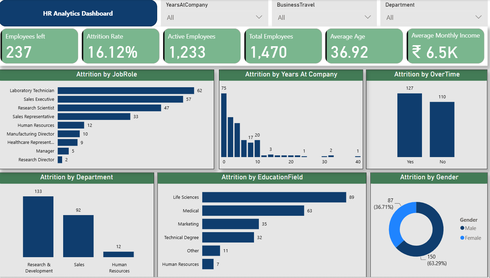

# HR Analytics Dashboard

## 📊 Project Overview

This project analyzes employee attrition and workforce data using Power BI.

The dashboard helps understand employee turnover by looking at factors such as department, job role, years at company, overtime, education field, and gender.

## 🛠️ Tools & Technologies

- Power BI
- Power Query
- DAX
- Excel

## 📌 Key Metrics

- Total Employees: 1,470
- Employees Left: 237
- Active Employees: 1,233
- Attrition Rate: 16.12%
- Average Age: 36.92
- Average Monthly Income: ₹6.5K

## 🔍 Key Insights

- Research & Development had the highest number of employees who left, with 133 employees.
- Laboratory Technician had the highest attrition among the job roles, with 62 employees leaving.
- Among employees who left, 127 had worked overtime compared with 110 who had not.
- The dashboard provides a breakdown of attrition across departments, job roles, education fields, gender, years at company, and overtime.

## 📈 Dashboard

## 💡 Skills Demonstrated

- Data Cleaning
- Data Transformation
- Data Analysis
- Data Visualization
- Power Query
- DAX Measures
- Dashboard Development
- Business Insights
